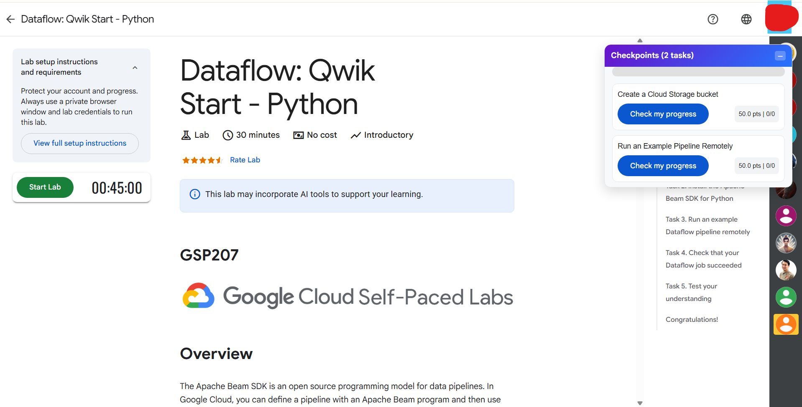
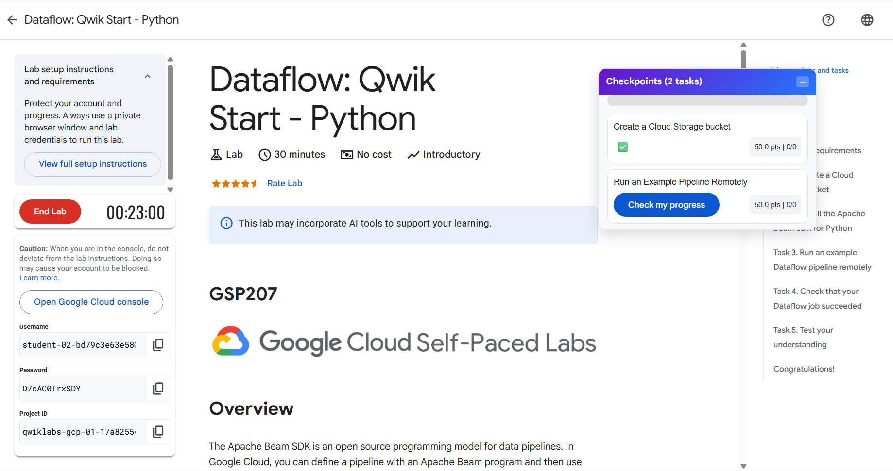

#===> use All-in-one folder for extension. later i will remove the other unnecesaary folders.

# 🌟 Cloud Skills Boost – Floating Task Panel Extension

This Chrome extension adds a **beautiful floating task panel** to **all Cloud Skills Boost lab pages**.  
It automatically lists **all tasks** from the page, each with a **"Check my progress"** button, and updates the panel in real time.

---

## ✨ Features
- 📌 Floating panel showing all lab tasks in one place.
- 🖱 Direct **"Check my progress"** buttons in the panel.
- ✅ Automatically updates task status when completed.
- 📊 Progress bar showing total completion percentage.
- 🎯 Works across all Cloud Skills Boost lab pages without manual refresh.
- 🎨 Modern, responsive, and draggable UI.

---

## 📥 Download & Install

### **1. Download Extension**
[⬇ **Download ZIP**](https://github.com/pulkitbarala/cloud-extension/archive/refs/heads/main.zip)  

### **2. Extract ZIP**
Unzip the downloaded folder to any location on your computer.

### **3. Install in Chrome**
1. Open **Chrome** and go to: chrome://extensions/
2. Enable **Developer mode** (top right).
3. Click **Load unpacked**.
4. Select the extracted folder containing the extension files.

---

## 🖼 Screenshots

### **Floating Panel on Lab Page**

### **Progress Update**

---

## 🚀 Usage
1. Open any Cloud Skills Boost lab.
2. The floating panel will automatically appear on the page.
3. Click **"Check my progress"** directly in the panel to verify tasks.
4. If completed, the panel will instantly update the task status.

---

## 🔄 Updates
- **All-in-One Extension** – No need for multiple extensions.
- Real-time update support for completed tasks.
- Optimized for faster load and refresh handling.

---

## 📌 Notes
- Works on **all** Cloud Skills Boost lab pages.
- Does not store or send any personal data.
- Requires Chrome or any Chromium-based browser.

---

## 📄 License
This extension is provided for **personal educational use only**.  
All rights to Cloud Skills Boost content belong to their respective owners.
